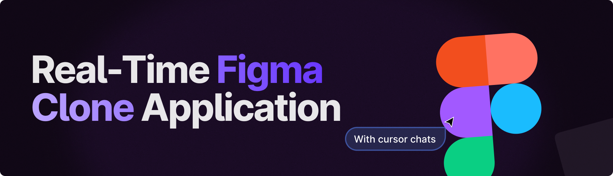
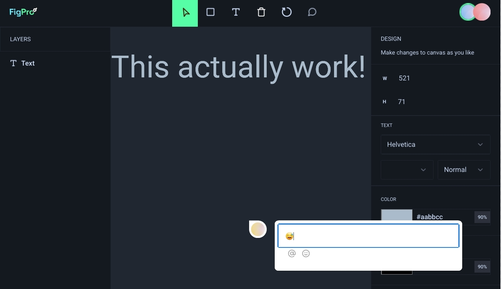
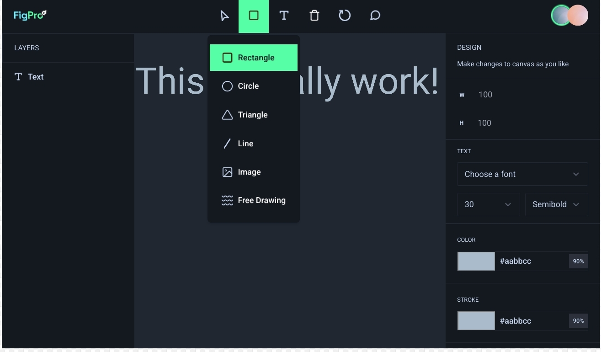
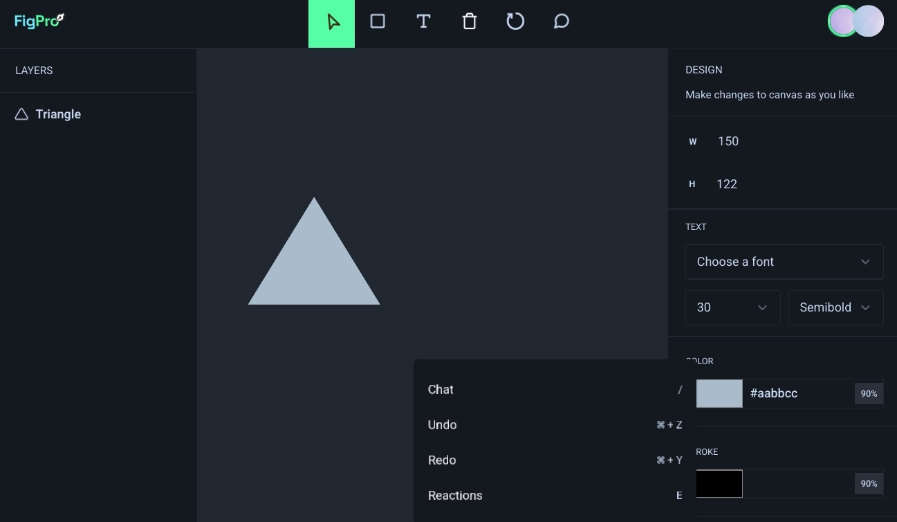

 

# Figma

A minimalistic Figma clone to show how to add real-world features like live collaboration with cursor chat, comments, reactions, and drawing designs (shapes, image upload) on the canvas using fabric.js.

# Technologies

Next.js
- TypeScript
- Liveblocks
- Fabric.js
- Shadcn
- Tailwind CSS

## <a name="features">🔋 Features</a>

👉 **Multi Cursors, Cursor Chat, and Reactions**: Allows multiple users to collaborate simultaneously by showing individual cursors, enabling real-time chat, and reactions for interactive communication.

👉 **Active Users**: Displays a list of currently active users in the collaborative environment, providing visibility into who is currently engaged.

👉 **Comment Bubbles**: Enables users to attach comments to specific elements on the canvas, fostering communication and feedback on design components.

👉 **Creating Different Shapes**: Provides tools for users to generate a variety of shapes on the canvas, allowing for diverse design elements

👉 **Uploading Images**: Import images onto the canvas, expanding the range of visual content in the design

👉 **Customization**: Allows users to adjust the properties of design elements, offering flexibility in customizing and fine-tuning visual components

👉 **Freeform Drawing**: Enables users to draw freely on the canvas, promoting artistic expression and creative design.

👉 **Undo/Redo**: Provides the ability to reverse (undo) or restore (redo) previous actions, offering flexibility in design decision-making

👉 **Keyboard Actions**: Allows users to utilize keyboard shortcuts for various actions, including copying, pasting, deleting, and triggering shortcuts for features like opening cursor chat, reactions, and more, enhancing efficiency and accessibility.

👉 **History**: Review the chronological history of actions and changes made on the canvas, aiding in project management and version control.

👉 **Deleting, Scaling, Moving, Clearing, Exporting Canvas**: Offers a range of functions for managing design elements, including deletion, scaling, moving, clearing the canvas, and exporting the final design for external use.

and many more, including code architecture, advanced react hooks, and reusability 

## Screenshots

## Getting Started

To run the project locally, follow these steps:

1. Clone the repository: `git clone <repository_url>`
2. Navigate to the project directory: `cd figma`
3. Install dependencies: `npm install`
4. Start the development server: `npm run dev`
